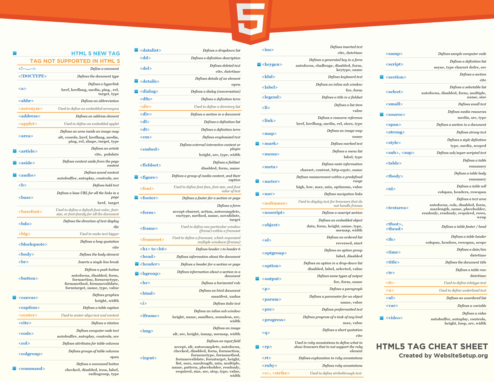

# learn-html-structure

This is a short introduction to the **HTML5 structure** and some basic HTML Tags for **beginners**. I recommend that you create a new index.html file with your editor eg. _Sublime_, _Atom Brackets_ or _Visual Studio Code_. I suggest that your insert All the HTML Tags from this introduction into your own **index.html** document and finally open the **index.html** in your browser eg. Mozilla FireFox or Chrome to check the result.

## The HTML `<head>` Element includes

## Here is an overview of the most popular HTML5 tags from WebsiteSetup.org

